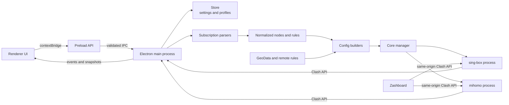

# Dart

## English

Dart is an Electron-based proxy client for Windows with support for both the
[sing-box](https://github.com/SagerNet/sing-box) and
[mihomo](https://github.com/MetaCubeX/mihomo/tree/Meta) cores. Each core keeps its own executable, runtime configuration, and GeoData, so switching cores does not require reinstalling either one.

This is an independent project and is not affiliated with or endorsed by sing-box, mihomo, or Zashboard.

### Features

- Keep sing-box and mihomo installed side by side, with in-app switching, download, and update management.
- Import Clash YAML, sing-box JSON, Base64 subscriptions, and common share links.
- Generate a runtime configuration for the selected core while preserving Clash rules and policy-group semantics in mihomo mode.
- Use system proxy, TUN, launch at login, silent startup, and UWP loopback exemption features.
- Manage local rules, remote rules, policy-group target overrides, and GeoData.
- View nodes, connections, traffic, logs, and latency through the Clash API.
- Let either core download and host the latest
  [Zashboard](https://github.com/Zephyruso/zashboard) release.
- Store large profile payloads separately so routine setting changes do not rewrite subscription contents.

### Architecture



The renderer has no direct access to Node.js or operating-system APIs. The preload script exposes the only allowed interface, while the main process handles validation, configuration generation, persistence, core processes, system proxy integration, and elevated operations.

Configuration flow:

1. Format detection dispatches an imported profile to the Clash, sing-box, or share-link parser.
2. Parsed data is normalized into an internal node, rule, and policy-group model.
3. `converter.js` generates sing-box JSON or mihomo YAML for the selected core.
4. `SingBoxManager` writes the configuration into the matching core directory, validates it, and starts the independent child process.
5. The main process reads runtime state through a local Clash API protected by a per-session random secret and sends only the required data to the renderer.

### Data Directories

On Windows, the default user-data directory is `%APPDATA%\Dart`:

```text
Dart/
├── config.json                 # Settings, profile metadata, and UI state
├── profiles/                   # Nodes, rules, and raw content for each profile
└── runtime/
    ├── singbox/
    │   ├── sing-box.exe
    │   ├── config.json
    │   ├── geoip-cn.srs
    │   └── geosite-cn.srs
    ├── mihomo/
    │   ├── mihomo.exe
    │   ├── config.yaml
    │   ├── geoip.dat
    │   ├── geosite.dat
    │   └── country.mmdb
    └── ui/
        └── zashboard/          # Local dashboard shared by both cores
```

Bundled cores are stored under `resources/bin/` and copied into the writable runtime directory when needed. Application updates do not merge or replace the two user runtime directories.

### Source Layout

```text
singbox-gui/
├── package.json                 # Scripts, dependencies, and electron-builder config
├── bin/                         # Downloaded cores and GeoData; ignored by Git
├── build/                       # Icons and NSIS installer configuration
├── scripts/
│   ├── download-core.js         # Downloads and validates both cores and GeoData
│   └── make-icon.js
├── src/
│   ├── main/
│   │   ├── index.js             # Electron lifecycle
│   │   ├── ipc.js               # IPC registration and input validation
│   │   ├── core-control.js      # Core, proxy, rule, and update orchestration
│   │   ├── singbox.js           # Core processes, downloads, paths, and GeoData
│   │   ├── converter.js         # sing-box and mihomo configuration builders
│   │   ├── subscription.js      # Format detection and parser dispatch
│   │   ├── store.js             # Atomic persistence and separate profile files
│   │   └── parsers/             # Clash, sing-box, and share-link parsers
│   ├── preload/index.js         # The renderer's only IPC boundary
│   └── renderer/                # HTML, CSS, and modular scripts without a bundler
├── test/                        # Conversion, unit, download, and smoke tests
└── .github/workflows/release.yml
```

### Development and Testing

Node.js 22 or later is required. Windows production builds use Node.js 24, PowerShell, and NSIS. macOS and Linux can be used for UI and most logic development, but Windows system proxy, UWP, and elevation flows must be verified on Windows.

```bash
npm ci
npm test
npm run dev
```

Download the latest stable releases of both cores and their GeoData:

```bash
npm run fetch-core
```

Set `SINGBOX_VERSION` or `MIHOMO_VERSION` to reproduce a specific core version. Empty variables resolve to the latest stable GitHub Release.

Build the Windows installer:

```bash
npm run fetch-core
npm run dist
```

Build output is written to `release/`. GitHub Actions runs the same test, core-download, and packaging flow. Manual runs may pin either core version; empty version inputs bundle the latest stable releases.

### Third-Party Components and Licenses

The Dart Electron UI, configuration management, and process orchestration code is declared as MIT in `package.json`. The installer and runtime also use the independent third-party components below. Each component remains subject to its upstream license and is not relicensed under Dart's license.

| Component | Purpose and distribution | Upstream license |
| --- | --- | --- |
| [sing-box](https://github.com/SagerNet/sing-box) | Independent core process bundled with the installer | [GPL v3 or later with the upstream additional notice](https://github.com/SagerNet/sing-box/blob/dev/LICENSE) |
| [mihomo](https://github.com/MetaCubeX/mihomo/tree/Meta) | Independent core process bundled with the installer | [GPL v3](https://github.com/MetaCubeX/mihomo/blob/Meta/LICENSE) |
| [SagerNet/sing-geoip](https://github.com/SagerNet/sing-geoip) | Bundled and updateable sing-box GeoIP rules | [GPL v3 or later](https://github.com/SagerNet/sing-geoip/blob/main/LICENSE) |
| [SagerNet/sing-geosite](https://github.com/SagerNet/sing-geosite) | Bundled and updateable sing-box Geosite rules | [GPL v3 or later](https://github.com/SagerNet/sing-geosite/blob/main/LICENSE) |
| [MetaCubeX/meta-rules-dat](https://github.com/MetaCubeX/meta-rules-dat) | Bundled and updateable mihomo GeoData | [GPL v3](https://github.com/MetaCubeX/meta-rules-dat/blob/master/LICENSE) |
| [Zashboard](https://github.com/Zephyruso/zashboard) | Clash API dashboard downloaded from the latest release when needed | [MIT](https://github.com/Zephyruso/zashboard/blob/main/LICENSE) |

Dart communicates with both cores through configuration files, standard streams, and the local Clash API; neither core is linked into the Electron application. Installer distributions should still preserve the copyright and license notices above and provide an upstream source-code location corresponding to each bundled binary version. The upstream `LICENSE` files are authoritative.

Node.js dependencies retain their individual licenses. Their resolved versions can be traced through `package-lock.json`.

---

## 中文

Dart 是一个以 Electron 构建的 Windows 代理客户端，同时支持
[sing-box](https://github.com/SagerNet/sing-box) 与
[mihomo](https://github.com/MetaCubeX/mihomo/tree/Meta) 内核。两个内核、配置和规则数据分别存放，切换内核时无需重复安装。

本项目不是 sing-box、mihomo 或 Zashboard 的官方项目，也不代表这些上游项目。

### 主要功能

- 同时保留 sing-box 与 mihomo，可在内核管理中切换、下载和更新。
- 支持 Clash YAML、sing-box JSON、Base64 配置和常见分享链接。
- 根据当前内核生成对应运行配置；mihomo 模式保留 Clash 规则与策略组语义。
- 支持系统代理、TUN、开机启动、静默启动和 UWP 回环豁免。
- 支持本地规则、远程规则、策略组目标覆盖和 GeoData 管理。
- 通过 Clash API 显示节点、连接、流量、日志和延迟。
- sing-box 与 mihomo 都可自动下载并托管最新版
  [Zashboard](https://github.com/Zephyruso/zashboard) 面板。
- 订阅正文与节点数据独立存储，设置修改不会重复写入大型配置文件。

### 架构


Renderer 不直接访问 Node.js 或操作系统能力。可调用接口只通过 `preload` 暴露，主进程负责输入校验、配置生成、持久化、内核进程、系统代理和管理员权限操作。

配置处理流程：

1. 配置订阅由格式探测器分发到 Clash、sing-box 或分享链接解析器。
2. 解析结果归一化为内部节点、规则和策略组数据。
3. `converter.js` 根据当前内核生成 sing-box JSON 或 mihomo YAML。
4. `SingBoxManager` 将配置写入对应内核目录，校验后启动独立子进程。
5. 主进程通过带随机密钥的本地 Clash API 读取状态，并把必要数据发送到界面。

### 数据目录

Windows 默认用户数据目录为 `%APPDATA%\Dart`：

```text
Dart/
├── config.json                 # 设置、配置元数据和界面状态
├── profiles/                   # 每个配置的节点、规则和原始正文
└── runtime/
    ├── singbox/
    │   ├── sing-box.exe
    │   ├── config.json
    │   ├── geoip-cn.srs
    │   └── geosite-cn.srs
    ├── mihomo/
    │   ├── mihomo.exe
    │   ├── config.yaml
    │   ├── geoip.dat
    │   ├── geosite.dat
    │   └── country.mmdb
    └── ui/
        └── zashboard/          # 两个内核共用的本地面板
```

打包时的内核位于 `resources/bin/`，首次使用时会复制到可写的运行目录。应用更新不会把两个内核的用户运行目录混在一起。

### 源码结构

```text
singbox-gui/
├── package.json                 # 脚本、依赖和 electron-builder 配置
├── bin/                         # 构建前下载的双内核与 GeoData，不提交 Git
├── build/                       # 图标与 NSIS 安装器配置
├── scripts/
│   ├── download-core.js         # 下载并校验双内核和对应 GeoData
│   └── make-icon.js
├── src/
│   ├── main/
│   │   ├── index.js             # Electron 生命周期
│   │   ├── ipc.js               # IPC 注册与输入校验
│   │   ├── core-control.js      # 配置、内核、代理、规则与自动更新编排
│   │   ├── singbox.js           # 双内核进程、下载、目录和 GeoData 管理
│   │   ├── converter.js         # sing-box 与 mihomo 配置生成
│   │   ├── subscription.js      # 配置格式探测和解析分发
│   │   ├── store.js             # 原子持久化与独立 profile 文件
│   │   └── parsers/             # Clash、sing-box 和分享链接解析器
│   ├── preload/index.js         # 唯一的 renderer IPC 边界
│   └── renderer/                # 无打包器的 HTML、CSS 和模块化脚本
├── test/                        # 转换、单元、下载和主进程冒烟测试
└── .github/workflows/release.yml
```

### 本地开发与测试

需要 Node.js 22 或更高版本。Windows 正式构建使用 Node.js 24、PowerShell 和 NSIS；macOS/Linux 可用于界面与大部分逻辑开发，但 Windows 系统代理、UWP 和提权流程只能在 Windows 验证。

```bash
npm ci
npm test
npm run dev
```

下载当前最新的两个内核和对应 GeoData：

```bash
npm run fetch-core
```

如需复现指定内核版本，可设置 `SINGBOX_VERSION` 和 `MIHOMO_VERSION`。变量为空时默认读取各自最新稳定 Release。

构建 Windows 安装包：

```bash
npm run fetch-core
npm run dist
```

输出位于 `release/`。GitHub Actions 使用相同的测试、内核下载和打包流程；手动运行时也可以填写内核版本，留空则打包最新版本。

### 第三方组件与许可证

Dart 的 Electron 界面、配置管理和进程编排代码在 `package.json` 中声明为 MIT。安装包或运行时还会使用下列独立第三方组件；它们不改用 Dart 的许可证，而是继续受各自上游许可证约束。

| 组件 | 用途与分发方式 | 上游许可证 |
| --- | --- | --- |
| [sing-box](https://github.com/SagerNet/sing-box) | 独立内核进程，随安装包提供 | [GPL v3 或更高版本及上游附加声明](https://github.com/SagerNet/sing-box/blob/dev/LICENSE) |
| [mihomo](https://github.com/MetaCubeX/mihomo/tree/Meta) | 独立内核进程，随安装包提供 | [GPL v3](https://github.com/MetaCubeX/mihomo/blob/Meta/LICENSE) |
| [SagerNet/sing-geoip](https://github.com/SagerNet/sing-geoip) | sing-box GeoIP 规则集，随安装包提供并可更新 | [GPL v3 或更高版本](https://github.com/SagerNet/sing-geoip/blob/main/LICENSE) |
| [SagerNet/sing-geosite](https://github.com/SagerNet/sing-geosite) | sing-box Geosite 规则集，随安装包提供并可更新 | [GPL v3 或更高版本](https://github.com/SagerNet/sing-geosite/blob/main/LICENSE) |
| [MetaCubeX/meta-rules-dat](https://github.com/MetaCubeX/meta-rules-dat) | mihomo GeoData，随安装包提供并可更新 | [GPL v3](https://github.com/MetaCubeX/meta-rules-dat/blob/master/LICENSE) |
| [Zashboard](https://github.com/Zephyruso/zashboard) | Clash API 面板，首次需要时从 latest Release 下载 | [MIT](https://github.com/Zephyruso/zashboard/blob/main/LICENSE) |

Dart 通过配置文件、标准输入输出和本地 Clash API 与两个内核通信，不把内核源码链接进 Electron 应用。发布安装包时仍应保留上表中的版权与许可证信息，并为随包二进制提供对应版本的上游源码入口。各项目的完整条款以上游 `LICENSE` 文件为准。

Node.js 依赖的许可证由各软件包分别声明，可通过 `package-lock.json` 追踪实际安装版本。
