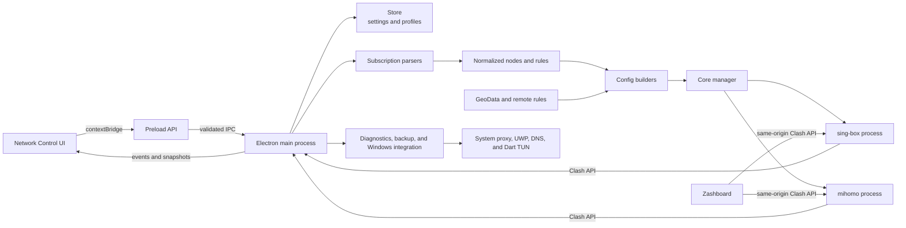

# Dart Network Control

## English

Dart Network Control is a native-feeling Windows desktop workspace for operating both the
[sing-box](https://github.com/SagerNet/sing-box) and
[mihomo](https://github.com/MetaCubeX/mihomo/tree/Meta) network cores. It brings profiles, routing, traffic, connections, logs, TUN, system proxy controls, and core maintenance into one operational interface. Each core keeps its own executable, runtime configuration, and GeoData, so switching cores does not require reinstalling either one.

This is an independent project and is not affiliated with or endorsed by sing-box, mihomo, or Zashboard.

### Features

- Operate sing-box and mihomo side by side from one network-control workspace, with in-app switching, download, and update management.
- Import Clash YAML, sing-box JSON, Base64 subscriptions, and common share links; the converter supports Clash-to-sing-box and sing-box-to-Clash output with automatic format detection.
- Generate a runtime configuration for the selected core while preserving Clash rules and policy-group semantics in mihomo mode.
- Use system proxy, TUN, launch at login, silent startup, desktop notifications, and UWP loopback exemption features.
- Give both cores a `Dart` TUN interface and keep the Windows network connection name at `Dart Tunnel`, including cleanup of legacy `tun0` and `Meta` adapters when switching cores.
- Manage local rules, remote rules, policy-group target overrides, and independently updateable GeoData with bundled-file recovery.
- Select manual, Auto, or Fallback routing and view the live outbound beside the traffic meter.
- View responsive node, connection, traffic, and log workspaces through the Clash API; node and connection lists use bounded virtual rendering.
- Inspect routes, validate both generated configs, diagnose ports/network egress, compare DNS paths, and export or restore user data.
- Let either core download and host the latest
  [Zashboard](https://github.com/Zephyruso/zashboard) release.
- Store large profile payloads separately and load heavy view data on demand so routine settings and status refreshes stay small.

### Quick Start

1. Download the latest Windows x64 installer from [GitHub Releases](https://github.com/blakebill/singbox-gui/releases/latest).
2. Add a config from Clash YAML, sing-box JSON, a subscription URL, or supported share links, then make it active.
3. Select sing-box or mihomo in **Core Management**, choose a node and routing mode, and start the core.
4. Enable **System Proxy** for application proxying or **TUN** for system-wide routing. Administrator permission is requested only by operations that require it.

Release installers bundle both cores and their matching GeoData. Core Management can keep either bundled copy, download the latest stable release, or switch between the two independent runtime directories.

### Desktop Experience

- A frameless custom title bar and Windows 11 Mica material where supported, with transparent Fluent-style surfaces rather than a browser-like page background.
- System, light, and dark themes plus complete English and Simplified Chinese interface switching.
- Full-width responsive pages with equal outer spacing. Nodes, connections, and logs fill the remaining window height and scroll internally.
- Two-column node cards, compact live traffic, the current outbound in the sidebar, and a tray icon that reflects stopped or running state.
- Close-to-tray and silent-start behavior, with background rendering and polling reduced while the window is hidden.

### Tools

| Tool | Purpose |
| --- | --- |
| Control Panel | Opens the locally hosted Zashboard for the running core |
| UWP Loopback | Lists Windows Store apps and applies loopback exemptions with automatic elevation when needed |
| Config Converter | Auto-detects Clash, sing-box, or share-link input and previews either Clash or sing-box output |
| Route Inspector | Shows the matched rule, policy target, final outbound, and DNS path for a domain or IP |
| Network Diagnostics | Checks the core, Clash API, ports, system proxy, TUN, DNS, and direct/proxy egress; reports can be exported |
| Config Checker | Validates generated sing-box and mihomo configurations and reports precise error locations |
| Port Inspector | Shows listeners and owning processes for the proxy, API, or custom ports |
| Backup & Restore | Exports configs, settings, and rules without cores or caches; selected files are revalidated before restore |
| DNS Comparison | Compares system, local, and remote DNS answers, latency, and suspicious divergence |

Backups contain raw profile contents and node credentials. Treat exported backup and diagnostic files as private data.

### Runtime and Performance

- Node, connection, and rule lists render only a bounded visible window instead of retaining thousands of DOM rows.
- Profile bodies, node data, and rule data are loaded only when their views need them; profile payload caching is deliberately bounded.
- Status IPC uses compact snapshots, connection polling is coalesced, and retained log output is capped.
- Atomic store writes protect settings, while large profile contents live in separate files to avoid rewriting them on every preference change.
- Hidden windows stop view-specific polling and reduce renderer frame rate, while the main process keeps the tray state current.

### Architecture



The Network Control renderer has no direct access to Node.js or operating-system APIs. The preload script exposes the only allowed interface, while the main process handles validation, configuration generation, persistence, core processes, system proxy integration, and elevated operations.

Configuration flow:

1. Format detection dispatches an imported profile to the Clash, sing-box, or share-link parser.
2. Parsed data is normalized into an internal node, rule, and policy-group model.
3. `converter.js` generates sing-box JSON or mihomo YAML for the selected core.
4. `SingBoxManager` writes the configuration into the matching core directory, validates it, and starts the independent child process.
5. The main process reads runtime state through a local Clash API protected by a per-session random secret and sends only the required data to the renderer.

### Data Directories

On Windows, the default user-data directory is `%APPDATA%\Dart`:

```text
Dart/
├── config.json                 # Settings, profile metadata, and UI state
├── profiles/                   # Nodes, rules, and raw content for each profile
└── runtime/
    ├── singbox/
    │   ├── sing-box.exe
    │   ├── config.json
    │   ├── geoip-cn.srs
    │   ├── geosite-cn.srs
    │   └── geodata-meta.json
    ├── mihomo/
    │   ├── mihomo.exe
    │   ├── config.yaml
    │   ├── geoip.dat
    │   ├── geosite.dat
    │   ├── country.mmdb
    │   └── geodata-meta.json
    └── ui/
        └── zashboard/          # Local dashboard shared by both cores
```

Bundled cores are stored under `resources/bin/` and copied into the writable runtime directory when needed. Application updates do not merge or replace the two user runtime directories.

### Source Layout

```text
singbox-gui/
├── package.json                 # Scripts, dependencies, and electron-builder config
├── bin/                         # Downloaded cores and GeoData; ignored by Git
├── build/                       # Icons and NSIS installer configuration
├── scripts/
│   ├── download-core.js         # Downloads and validates both cores and GeoData
│   └── make-icon.js
├── src/
│   ├── main/
│   │   ├── index.js             # Electron lifecycle
│   │   ├── window.js            # Frameless window, Mica, and background throttling
│   │   ├── ipc.js               # IPC registration and input validation
│   │   ├── core-control.js      # Core, proxy, rule, and update orchestration
│   │   ├── singbox.js           # Core processes, downloads, paths, and GeoData
│   │   ├── tun-adapter.js       # Windows Dart TUN cleanup and display naming
│   │   ├── toolbox.js           # Diagnostics, route/DNS checks, and backups
│   │   ├── converter.js         # sing-box and mihomo configuration builders
│   │   ├── subscription.js      # Format detection and parser dispatch
│   │   ├── store.js             # Atomic persistence and separate profile files
│   │   └── parsers/             # Clash, sing-box, and share-link parsers
│   ├── preload/index.js         # The renderer's only IPC boundary
│   └── renderer/                # HTML, CSS, and modular scripts without a bundler
├── test/                        # Conversion, unit, download, and smoke tests
└── .github/workflows/release.yml
```

### Development and Testing

Node.js 22 or later is required. Windows production builds use Node.js 24, PowerShell, and NSIS. macOS and Linux can be used for UI and most logic development, but Windows system proxy, UWP, and elevation flows must be verified on Windows.

```bash
npm ci
npm test
npm run dev
```

`npm ci` installs dependencies only into this repository's `node_modules`; no global npm packages are required.

Download the latest stable releases of both cores and their GeoData:

```bash
npm run fetch-core
```

Set `SINGBOX_VERSION` or `MIHOMO_VERSION` to reproduce a specific core version. Empty variables resolve to the latest stable GitHub Release.

Build the Windows installer:

```bash
npm run fetch-core
npm run dist
```

Build output is written to `release/`. For a local release, `npm version 0.8.1 --no-git-tag-version` updates both `package.json` and `package-lock.json`; replace `0.8.1` with the intended version. GitHub Actions runs the same test, core-download, and packaging flow and synchronizes the package version from the release tag. Manual runs may pin either core version; empty version inputs bundle the latest stable releases.

### Third-Party Components and Licenses

The Dart Network Control Electron UI, configuration management, and process orchestration code is declared as MIT in `package.json`. The installer and runtime also use the independent third-party components below. Each component remains subject to its upstream license and is not relicensed under Dart's license.

| Component | Purpose and distribution | Upstream license |
| --- | --- | --- |
| [sing-box](https://github.com/SagerNet/sing-box) | Independent core process bundled with the installer | [GPL v3 or later with the upstream additional notice](https://github.com/SagerNet/sing-box/blob/dev/LICENSE) |
| [mihomo](https://github.com/MetaCubeX/mihomo/tree/Meta) | Independent core process bundled with the installer | [GPL v3](https://github.com/MetaCubeX/mihomo/blob/Meta/LICENSE) |
| [SagerNet/sing-geoip](https://github.com/SagerNet/sing-geoip) | Bundled and updateable sing-box GeoIP rules | [GPL v3 or later](https://github.com/SagerNet/sing-geoip/blob/main/LICENSE) |
| [SagerNet/sing-geosite](https://github.com/SagerNet/sing-geosite) | Bundled and updateable sing-box Geosite rules | [GPL v3 or later](https://github.com/SagerNet/sing-geosite/blob/main/LICENSE) |
| [MetaCubeX/meta-rules-dat](https://github.com/MetaCubeX/meta-rules-dat) | Bundled and updateable mihomo GeoData | [GPL v3](https://github.com/MetaCubeX/meta-rules-dat/blob/master/LICENSE) |
| [Zashboard](https://github.com/Zephyruso/zashboard) | Clash API dashboard downloaded from the latest release when needed | [MIT](https://github.com/Zephyruso/zashboard/blob/main/LICENSE) |

Dart Network Control communicates with both cores through configuration files, standard streams, and the local Clash API; neither core is linked into the Electron application. Installer distributions should still preserve the copyright and license notices above and provide an upstream source-code location corresponding to each bundled binary version. The upstream `LICENSE` files are authoritative.

Node.js dependencies retain their individual licenses. Their resolved versions can be traced through `package-lock.json`.

---

## 中文

Dart Network Control 是一个具有原生桌面体验的 Windows 网络控制工具，同时支持
[sing-box](https://github.com/SagerNet/sing-box) 与
[mihomo](https://github.com/MetaCubeX/mihomo/tree/Meta) 内核。它把配置、路由、流量、连接、日志、TUN、系统代理和内核维护集中在一个操作界面中。两个内核、配置和规则数据分别存放，切换内核时无需重复安装。

本项目不是 sing-box、mihomo 或 Zashboard 的官方项目，也不代表这些上游项目。

### 主要功能

- 在统一的 Network Control 工作区中同时管理 sing-box 与 mihomo，可在内核管理中切换、下载和更新。
- 支持 Clash YAML、sing-box JSON、Base64 配置和常见分享链接；配置转换器可自动识别格式，并支持 Clash 与 sing-box 双向输出。
- 根据当前内核生成对应运行配置；mihomo 模式保留 Clash 规则与策略组语义。
- 支持系统代理、TUN、开机启动、静默启动、桌面通知和 UWP 回环豁免。
- 两个内核统一创建名为 `Dart` 的 TUN 接口，并在 Windows 中保持 `Dart Tunnel` 网络连接名称；切换内核时会清理旧的 `tun0` 和 `Meta` 适配器。
- 支持本地规则、远程规则、策略组目标覆盖和独立更新的 GeoData，并可从安装包自动恢复缺失或损坏的规则文件。
- 支持手动、Auto 和 Fallback 节点策略，并在侧栏流量图下显示当前实际出站。
- 通过 Clash API 显示自适应的节点、连接、流量和日志界面；节点与连接列表采用有界虚拟渲染。
- 提供路由检查、双内核配置校验、端口与网络诊断、DNS 对比以及用户数据备份恢复工具。
- sing-box 与 mihomo 都可自动下载并托管最新版
  [Zashboard](https://github.com/Zephyruso/zashboard) 面板。
- 配置正文与节点数据独立存储，大型界面数据按需加载，日常设置和状态刷新保持轻量。

### 快速开始

1. 从 [GitHub Releases](https://github.com/blakebill/singbox-gui/releases/latest) 下载最新 Windows x64 安装包。
2. 通过 Clash YAML、sing-box JSON、配置链接或受支持的分享链接添加配置，并将其设为当前配置。
3. 在**内核管理**中选择 sing-box 或 mihomo，选择节点与路由模式，然后启动内核。
4. 普通应用代理可开启**系统代理**，全局接管流量可开启 **TUN**。只有确实需要提权的操作才会申请管理员权限。

发布安装包会同时包含两个内核及各自 GeoData。内核管理可继续使用打包版本、下载最新稳定版，或在两个独立运行目录之间切换。

### 桌面体验

- 使用无边框自定义标题栏，并在支持的 Windows 11 系统上启用 Mica 云母材质；透明 Fluent 风格元素不会呈现传统网页背景。
- 支持跟随系统、浅色和深色主题，并可完整切换简体中文与英文界面。
- 所有页面采用全宽自适应和统一四边间距；节点、连接与日志会占满窗口剩余高度，并仅在内容区内部滚动。
- 节点采用双列卡片，侧栏显示精简实时流量和当前出站，托盘图标会区分停止与运行状态。
- 支持关闭到托盘和静默启动；窗口隐藏后会降低渲染与页面轮询开销。

### 工具箱

| 工具 | 用途 |
| --- | --- |
| 控制面板 | 打开由当前运行内核本地托管的 Zashboard |
| UWP 回环 | 列出 Windows Store 应用并设置回环豁免，需要时自动申请管理员权限 |
| 配置转换 | 自动识别 Clash、sing-box 或分享链接输入，并预览 Clash 或 sing-box 输出 |
| 路由检查器 | 输入域名或 IP，查看命中规则、策略目标、最终出站和 DNS 路径 |
| 一键网络诊断 | 检查内核、Clash API、端口、系统代理、TUN、DNS 和直连/代理出口，并可导出报告 |
| 配置检查器 | 校验生成的 sing-box 与 mihomo 配置，并显示精确错误位置 |
| 端口检查 | 查看代理端口、API 端口或自定义端口的监听状态与占用进程 |
| 备份与恢复 | 导出配置、设置和规则，不包含内核与缓存；恢复前会重新校验所选文件 |
| DNS 对比 | 对比系统、本地与远程 DNS 的解析结果、耗时和可疑差异 |

备份中包含配置原文与节点凭据，导出的备份和诊断文件应按私密数据保管。

### 运行与性能

- 节点、连接和规则列表只渲染有界的可见窗口，不会一次保留数千个 DOM 节点。
- 配置正文、节点和规则数据仅在对应页面需要时加载，配置正文缓存数量也受到限制。
- 状态 IPC 使用精简快照，连接轮询会合并重复请求，日志保留长度设有上限。
- 设置采用原子写入；大型配置正文保存在独立文件中，修改偏好设置时无需重复写入。
- 窗口隐藏后停止页面专属轮询并降低 Renderer 帧率，主进程仍会持续维护托盘状态。

### 架构


Network Control 的 Renderer 不直接访问 Node.js 或操作系统能力。可调用接口只通过 `preload` 暴露，主进程负责输入校验、配置生成、持久化、内核进程、系统代理和管理员权限操作。

配置处理流程：

1. 配置订阅由格式探测器分发到 Clash、sing-box 或分享链接解析器。
2. 解析结果归一化为内部节点、规则和策略组数据。
3. `converter.js` 根据当前内核生成 sing-box JSON 或 mihomo YAML。
4. `SingBoxManager` 将配置写入对应内核目录，校验后启动独立子进程。
5. 主进程通过带随机密钥的本地 Clash API 读取状态，并把必要数据发送到界面。

### 数据目录

Windows 默认用户数据目录为 `%APPDATA%\Dart`：

```text
Dart/
├── config.json                 # 设置、配置元数据和界面状态
├── profiles/                   # 每个配置的节点、规则和原始正文
└── runtime/
    ├── singbox/
    │   ├── sing-box.exe
    │   ├── config.json
    │   ├── geoip-cn.srs
    │   ├── geosite-cn.srs
    │   └── geodata-meta.json
    ├── mihomo/
    │   ├── mihomo.exe
    │   ├── config.yaml
    │   ├── geoip.dat
    │   ├── geosite.dat
    │   ├── country.mmdb
    │   └── geodata-meta.json
    └── ui/
        └── zashboard/          # 两个内核共用的本地面板
```

打包时的内核位于 `resources/bin/`，首次使用时会复制到可写的运行目录。应用更新不会把两个内核的用户运行目录混在一起。

### 源码结构

```text
singbox-gui/
├── package.json                 # 脚本、依赖和 electron-builder 配置
├── bin/                         # 构建前下载的双内核与 GeoData，不提交 Git
├── build/                       # 图标与 NSIS 安装器配置
├── scripts/
│   ├── download-core.js         # 下载并校验双内核和对应 GeoData
│   └── make-icon.js
├── src/
│   ├── main/
│   │   ├── index.js             # Electron 生命周期
│   │   ├── window.js            # 无边框窗口、Mica 与后台渲染限制
│   │   ├── ipc.js               # IPC 注册与输入校验
│   │   ├── core-control.js      # 配置、内核、代理、规则与自动更新编排
│   │   ├── singbox.js           # 双内核进程、下载、目录和 GeoData 管理
│   │   ├── tun-adapter.js       # Windows Dart TUN 清理与显示名称同步
│   │   ├── toolbox.js           # 网络诊断、路由/DNS 检查与备份
│   │   ├── converter.js         # sing-box 与 mihomo 配置生成
│   │   ├── subscription.js      # 配置格式探测和解析分发
│   │   ├── store.js             # 原子持久化与独立 profile 文件
│   │   └── parsers/             # Clash、sing-box 和分享链接解析器
│   ├── preload/index.js         # 唯一的 renderer IPC 边界
│   └── renderer/                # 无打包器的 HTML、CSS 和模块化脚本
├── test/                        # 转换、单元、下载和主进程冒烟测试
└── .github/workflows/release.yml
```

### 本地开发与测试

需要 Node.js 22 或更高版本。Windows 正式构建使用 Node.js 24、PowerShell 和 NSIS；macOS/Linux 可用于界面与大部分逻辑开发，但 Windows 系统代理、UWP 和提权流程只能在 Windows 验证。

```bash
npm ci
npm test
npm run dev
```

`npm ci` 只会把依赖安装到当前仓库的 `node_modules`，不需要安装任何全局 npm 软件包。

下载当前最新的两个内核和对应 GeoData：

```bash
npm run fetch-core
```

如需复现指定内核版本，可设置 `SINGBOX_VERSION` 和 `MIHOMO_VERSION`。变量为空时默认读取各自最新稳定 Release。

构建 Windows 安装包：

```bash
npm run fetch-core
npm run dist
```

输出位于 `release/`。本地准备发布时可运行 `npm version 0.8.1 --no-git-tag-version`，它会同时更新 `package.json` 与 `package-lock.json`；请把 `0.8.1` 替换为目标版本。GitHub Actions 使用相同的测试、内核下载和打包流程，并会根据发布标签同步软件包版本；手动运行时也可以填写内核版本，留空则打包最新稳定版。

### 第三方组件与许可证

Dart Network Control 的 Electron 界面、配置管理和进程编排代码在 `package.json` 中声明为 MIT。安装包或运行时还会使用下列独立第三方组件；它们不改用 Dart 的许可证，而是继续受各自上游许可证约束。

| 组件 | 用途与分发方式 | 上游许可证 |
| --- | --- | --- |
| [sing-box](https://github.com/SagerNet/sing-box) | 独立内核进程，随安装包提供 | [GPL v3 或更高版本及上游附加声明](https://github.com/SagerNet/sing-box/blob/dev/LICENSE) |
| [mihomo](https://github.com/MetaCubeX/mihomo/tree/Meta) | 独立内核进程，随安装包提供 | [GPL v3](https://github.com/MetaCubeX/mihomo/blob/Meta/LICENSE) |
| [SagerNet/sing-geoip](https://github.com/SagerNet/sing-geoip) | sing-box GeoIP 规则集，随安装包提供并可更新 | [GPL v3 或更高版本](https://github.com/SagerNet/sing-geoip/blob/main/LICENSE) |
| [SagerNet/sing-geosite](https://github.com/SagerNet/sing-geosite) | sing-box Geosite 规则集，随安装包提供并可更新 | [GPL v3 或更高版本](https://github.com/SagerNet/sing-geosite/blob/main/LICENSE) |
| [MetaCubeX/meta-rules-dat](https://github.com/MetaCubeX/meta-rules-dat) | mihomo GeoData，随安装包提供并可更新 | [GPL v3](https://github.com/MetaCubeX/meta-rules-dat/blob/master/LICENSE) |
| [Zashboard](https://github.com/Zephyruso/zashboard) | Clash API 面板，首次需要时从 latest Release 下载 | [MIT](https://github.com/Zephyruso/zashboard/blob/main/LICENSE) |

Dart Network Control 通过配置文件、标准输入输出和本地 Clash API 与两个内核通信，不把内核源码链接进 Electron 应用。发布安装包时仍应保留上表中的版权与许可证信息，并为随包二进制提供对应版本的上游源码入口。各项目的完整条款以上游 `LICENSE` 文件为准。

Node.js 依赖的许可证由各软件包分别声明，可通过 `package-lock.json` 追踪实际安装版本。
