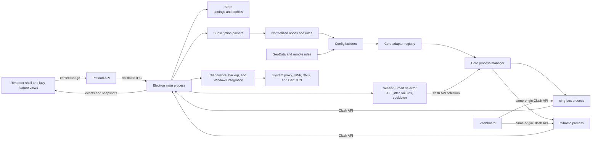

# Dart Network Control

Dart Network Control is a native-feeling Windows desktop workspace for operating both the
[Dart's maintained sing-box fork](https://github.com/blakebill/sing-box) and
[mihomo](https://github.com/MetaCubeX/mihomo/tree/Meta) network cores. It brings profiles, routing, traffic, connections, logs, TUN, system proxy controls, and core maintenance into one operational interface. Each core keeps its own executable, runtime configuration, and GeoData, so switching cores does not require reinstalling either one.

This is an independent project and is not affiliated with or endorsed by sing-box, mihomo, or Zashboard.

### Features

- Run and manage sing-box and mihomo independently, including in-app switching, downloads, and updates.
- Import Clash, sing-box, Base64, and share-link configs, with automatic bidirectional conversion between Clash and sing-box.
- Use system proxy or TUN alongside launch-at-login, silent startup, notifications, and UWP loopback exemptions.
- Manage local and remote rules, policy groups, GeoData, and manual, Auto, Smart, or Fallback routing.
- Monitor nodes, traffic, connections, logs, and latency, or open the locally hosted [Zashboard](https://github.com/Zephyruso/zashboard).
- Inspect routes, validate configs, diagnose networking and DNS, inspect ports, and back up or restore user data.

### Quick Start

1. Download the latest Windows x64 installer from [GitHub Releases](https://github.com/blakebill/singbox-gui/releases/latest).
2. Add a config from Clash YAML, sing-box JSON, a subscription URL, or supported share links, then make it active.
3. Select sing-box or mihomo in **Core Management**, choose a node and routing mode, and start the core.
4. Enable **System Proxy** for application proxying or **TUN** for system-wide routing. Administrator permission is requested only by operations that require it.

Release installers bundle both cores and their matching GeoData. Core Management can keep either bundled copy, download the latest stable release, or switch between the two independent runtime directories.

### Desktop Experience

- A frameless custom title bar and Windows 11 Mica material where supported, with transparent Fluent-style surfaces rather than a browser-like page background.
- System, light, and dark themes plus complete English and Simplified Chinese interface switching.
- Full-width responsive pages with equal outer spacing. Nodes, connections, and logs fill the remaining window height and scroll internally.
- Two-column node cards, compact live traffic, the current outbound in the sidebar, and a tray icon that reflects stopped or running state.
- Close-to-tray and silent-start behavior, with background rendering and polling reduced while the window is hidden.

### Tools

| Tool | Purpose |
| --- | --- |
| Control Panel | Opens the locally hosted Zashboard for the running core |
| UWP Loopback | Lists Windows Store apps and applies loopback exemptions with automatic elevation when needed |
| Config Converter | Auto-detects Clash, sing-box, or share-link input and previews either Clash or sing-box output |
| Route Inspector | Shows the matched rule, policy target, final outbound, and DNS path for a domain or IP |
| Network Diagnostics | Checks the core, Clash API, ports, system proxy, TUN, DNS, and direct/proxy egress; reports can be exported |
| Config Checker | Validates generated sing-box and mihomo configurations and reports precise error locations |
| Port Inspector | Shows listeners and owning processes for the proxy, API, or custom ports |
| Backup & Restore | Exports configs, settings, and rules without cores or caches; selected files are revalidated before restore |
| DNS Comparison | Compares system, local, and remote DNS answers, latency, and suspicious divergence |

Backups contain raw profile contents and node credentials. Treat exported backup and diagnostic files as private data.

### Runtime and Performance

- Feature views and secondary dialogs load their renderer modules on first use, while shared CSS is split by responsibility and loaded in a stable cascade.
- Node, connection, and rule lists render only a bounded visible window instead of retaining thousands of DOM rows.
- Profile bodies, node data, and rule data are loaded only when their views need them; profile payload caching is deliberately bounded.
- Status IPC uses compact snapshots, connection polling is coalesced, and retained log output is capped.
- Atomic store writes protect settings, while large profile contents live in separate files to avoid rewriting them on every preference change.
- Hidden windows stop view-specific polling and reduce renderer frame rate, while the main process keeps the tray state current.

### Architecture



The Network Control renderer has no direct access to Node.js or operating-system APIs. Feature views and native secondary dialogs are loaded on demand, the preload script exposes the only allowed interface, and the main process handles validation, configuration generation, persistence, core processes, system proxy integration, and elevated operations.

Configuration flow:

1. Format detection dispatches an imported profile to the Clash, sing-box, or share-link parser.
2. Parsed data is normalized into an internal node, rule, and policy-group model.
3. The selected core adapter generates sing-box JSON or mihomo YAML and supplies its paths, commands, GeoData capabilities, release assets, and export behavior.
4. `CoreManager` uses that adapter to write and validate the configuration, verify downloaded core archives, and start the independent child process.
5. The main process reads runtime state through a local Clash API protected by a per-session random secret and sends only the required data to the renderer.

### Data Directories

On Windows, the default user-data directory is `%APPDATA%\Dart`:

```text
Dart/
├── config.json                 # Settings, profile metadata, and UI state
├── profiles/                   # Nodes, rules, and raw content for each profile
└── runtime/
    ├── singbox/
    │   ├── sing-box.exe
    │   ├── config.json
    │   ├── geoip-cn.srs
    │   ├── geosite-cn.srs
    │   └── geodata-meta.json
    ├── mihomo/
    │   ├── mihomo.exe
    │   ├── config.yaml
    │   ├── geoip.dat
    │   ├── geosite.dat
    │   ├── country.mmdb
    │   └── geodata-meta.json
    └── ui/
        └── zashboard/          # Local dashboard shared by both cores
```

Bundled cores are stored under `resources/bin/` and copied into the writable runtime directory when needed. Application updates do not merge or replace the two user runtime directories.

### Source Layout

```text
singbox-gui/
├── package.json                 # Scripts, dependencies, and electron-builder config
├── bin/                         # Downloaded cores and GeoData; ignored by Git
├── build/                       # Icons and NSIS installer configuration
├── scripts/
│   ├── download-core.js         # Pins, verifies, and inventories cores and GeoData
│   ├── release-metadata.js      # CycloneDX SBOM and SHA-256 release manifest
│   └── make-icon.js
├── src/
│   ├── main/
│   │   ├── index.js             # Electron lifecycle
│   │   ├── window.js            # Frameless window, Mica, and background throttling
│   │   ├── ipc.js               # Domain IPC registration
│   │   ├── ipc-validation.js    # Shared payload limits and validation
│   │   ├── core-control.js      # Core, proxy, rule, and update orchestration
│   │   ├── core-adapters.js     # sing-box and mihomo capabilities
│   │   ├── operation-coordinator.js # Serialized mutations and stale-work guards
│   │   ├── singbox.js           # Core processes, downloads, paths, and GeoData
│   │   ├── tun-adapter.js       # Windows Dart TUN cleanup and display naming
│   │   ├── toolbox.js           # Diagnostics, route/DNS checks, and backups
│   │   ├── converter.js         # sing-box and mihomo configuration builders
│   │   ├── subscription.js      # Format detection and parser dispatch
│   │   ├── store.js             # Atomic persistence and separate profile files
│   │   └── parsers/             # Clash, sing-box, and share-link parsers
│   ├── preload/index.js         # The renderer's only IPC boundary
│   └── renderer/
│       ├── index.html           # Main application shell
│       ├── dialog.html          # Shared host for secondary windows
│       ├── js/                  # Feature modules loaded on first use
│       ├── dialog/              # Secondary-window workflows and styles
│       ├── styles/              # Surfaces, controls, lists, tools, and motion
│       └── style.css            # Design tokens, reset, and application layout
├── test/                        # Conversion, unit, download, and smoke tests
└── .github/workflows/release.yml
```

### Development and Testing

Node.js 22 or later is required. Windows production builds use Node.js 24, PowerShell, and NSIS. macOS and Linux can be used for UI and most logic development, but Windows system proxy, UWP, and elevation flows must be verified on Windows.

```bash
npm ci
npm test
npm run dev
```

`npm ci` installs dependencies only into this repository's `node_modules`; no global npm packages are required.

Download the latest stable releases of both cores and their GeoData:

```bash
npm run fetch-core
```

Set `SINGBOX_VERSION` or `MIHOMO_VERSION` to reproduce a specific core version. Empty variables resolve to the latest stable GitHub Release.

Build the Windows installer:

```bash
npm run fetch-core
npm run dist
```

Build output is written to `release/`. For a local patch release, `npm version patch --no-git-tag-version` updates both `package.json` and `package-lock.json`; an explicit target version can be used instead of `patch`. GitHub Actions runs the same test, core-download, and packaging flow and synchronizes the package version from the release tag. Manual runs may pin either core version; empty version inputs bundle the latest stable releases.

### Release Security

- `npm ci` installs exactly the versions and integrity hashes in `package-lock.json`; Dependabot monitors npm and GitHub Actions updates.
- Release workflow actions are pinned to immutable commit SHAs, build and publish permissions are isolated, runtime dependencies are audited, and downloaded core/GeoData release assets must match upstream SHA-256 digests. SagerNet rule sets are fetched from resolved immutable commit IDs.
- Every Dart release publishes `SHA256SUMS.txt` and a CycloneDX `sbom.cdx.json`. In-app installer updates refuse to execute when no matching SHA-256 digest is available.
- Windows Authenticode signing is optional. Configure the repository secrets `WINDOWS_CERTIFICATE` and `WINDOWS_CERTIFICATE_PASSWORD`; the workflow verifies every generated executable before publishing when signing is enabled.

Generate the same release metadata after a local build with `npm run release:metadata`. Keep signing certificates and passwords only in GitHub Actions secrets, never in the repository.

### Third-Party Components and Licenses

The Dart Network Control Electron UI, configuration management, and process orchestration code is declared as MIT in `package.json`. The installer and runtime also use the independent third-party components below. Each component remains subject to its upstream license and is not relicensed under Dart's license.

| Component | Purpose and distribution | Upstream license |
| --- | --- | --- |
| [Dart sing-box fork](https://github.com/blakebill/sing-box) | Independent core process bundled with the installer; patched from [SagerNet/sing-box](https://github.com/SagerNet/sing-box) | [GPL v3 or later with the upstream additional notice](https://github.com/SagerNet/sing-box/blob/dev/LICENSE) |
| [mihomo](https://github.com/MetaCubeX/mihomo/tree/Meta) | Independent core process bundled with the installer | [GPL v3](https://github.com/MetaCubeX/mihomo/blob/Meta/LICENSE) |
| [SagerNet/sing-geoip](https://github.com/SagerNet/sing-geoip) | Bundled and updateable sing-box GeoIP rules | [GPL v3 or later](https://github.com/SagerNet/sing-geoip/blob/main/LICENSE) |
| [SagerNet/sing-geosite](https://github.com/SagerNet/sing-geosite) | Bundled and updateable sing-box Geosite rules | [GPL v3 or later](https://github.com/SagerNet/sing-geosite/blob/main/LICENSE) |
| [MetaCubeX/meta-rules-dat](https://github.com/MetaCubeX/meta-rules-dat) | Bundled and updateable mihomo GeoData | [GPL v3](https://github.com/MetaCubeX/meta-rules-dat/blob/master/LICENSE) |
| [Zashboard](https://github.com/Zephyruso/zashboard) | Clash API dashboard downloaded from the latest release when needed | [MIT](https://github.com/Zephyruso/zashboard/blob/main/LICENSE) |

Dart Network Control communicates with both cores through configuration files, standard streams, and the local Clash API; neither core is linked into the Electron application. Installer distributions should still preserve the copyright and license notices above and provide an upstream source-code location corresponding to each bundled binary version. The upstream `LICENSE` files are authoritative.

Node.js dependencies retain their individual licenses. Their resolved versions can be traced through `package-lock.json`.
